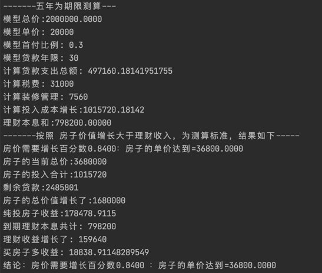

##  房产投资模型 V0.1

    同志们，现在是2021年，在这个时间，一系列房产打压政策，但是也有很多和我一样的刚需，到底买不买
    大部分人对房产购买停留在嘴上说说，那么究竟房子投资挣钱不挣钱，看看这个仓库吧，
    这个仓库是一个简单的房产投资模型 V0.1

    我们团队用数据说话，Talk is cheap. Show me the code

---
## 测算问题：买房子的收益 与  用买房子和每个月还贷款的费用去理财 哪个收益更高？
**先上结论图**：
-----

-----
### 结论：我知道很多人要说你这个结论有问题，没事，尽管提出你的看法，只要你说的有道理可量化，我们就更新模型
    我们也知道这个模型有问题，因为我们才经过了数十轮测算，这只是其中一个测试结果，参数有很大优化空间，

    但是，这个模型虽然放大了一丢丢问题，但是还是反映了真实的问题，模型本身是具有可信度的，

    假如你觉得我们的计算方式不对，欢迎给我提出issue,提出pr,加群和我们讨论。成为我们团队的伙伴。

## 实验验证

#### 设计思想
**这个房产投资收益模型包含三个子模型,评价维度是：外推N年后的理财和房产投资的收益差距**

##### 房子模型参数：
    总价、总面积、单价 、契税费率、印花税、首付比例、首付、贷款年限、贷款利率、贷款月利率、租金等等

    带入参数后，构建房子，该房子模型适合任意城市的房子模型，但是结果不一定哦，各位要自己分辨。
-----------------------------------------------

##### 买房子持续投入模型参数：
    首付、利息、装修、契税、印花税、出租、装修费用、物业费用月单价等等

    这个投入是你在买房子后，会不断的投入金钱，贷款利息之类的
-----------------------------------------------
##### 理财模型参数:
    利率，本金、时间
    1. 时间取推理结束时间
    2. 本金取首付加装修、税费、物业计算利率，3. 另外还贷款的金额是线性递增的，用来计算利息的时间是递减的，通过统计公式，加上这一部分的理财利息
-----------------------------------------------
##### 推算时间：N 年

    通过比较五年后卖出房子的收益和理财的收益 计算出房子需要涨到多少比例和价格 才能和理财转的一样多

### 如图举个例子：
    看图就行了  我就不解释了

----------------------------------
----------------------------------
----------------------------------
----------------------------------

###   愿景：给辛苦的打工人 实现财富自由提供一个的思路，引起一些讨论

###   团队介绍：
1. 主力是我和我的几个朋友，大家在做研究之余，想量化一下普通人买房这个事。
2. 介绍一下我和我的朋友们，几个从事不同行业但是对经济有兴趣的研究生，出身于大连理工，华东师范，上海财经，华东理工，安徽工业大学等
3. 大家目前有已经工作的，有继续读书学习的，有做程序的，有做金融的，有做环境的，有研究宏观经济的。
4. 欢迎大家贡献自己的想法和计算逻辑，当然也欢迎加入我们！
5. 欢迎提出pr，我们团队经过论证后会实现它，放在这个仓库。

### 我们会不断改进模型，到第三版本预计会开源

    模型暂时开源设计思想，代码暂时不开源，

    只是暂时，人多了就开源啦！！！

### 团队招人
1. 财经类伙伴：帮我们修正这个计算策略，要是能读懂paper就更好了，中文paper就可以，加油加油
1. 工程师：python和Go开发者，这个难度不大，耗时也不多，合作起来比较快
1. 团队内部，我们会使用腾讯会议，定期分享设计思路，增强模型

### 讨论群
    qq群(941283248)

### 我们需要帮助：
++我们需要大家的五分熟的想法，专业的财务统计知识人员，宏观市场理解和看法，微观经济学看，政策理解解读的看法，充实我们的模型++

###  赞助 如果你觉得这个事情有价值，可以给我们打赏，支持一下我们的工作

